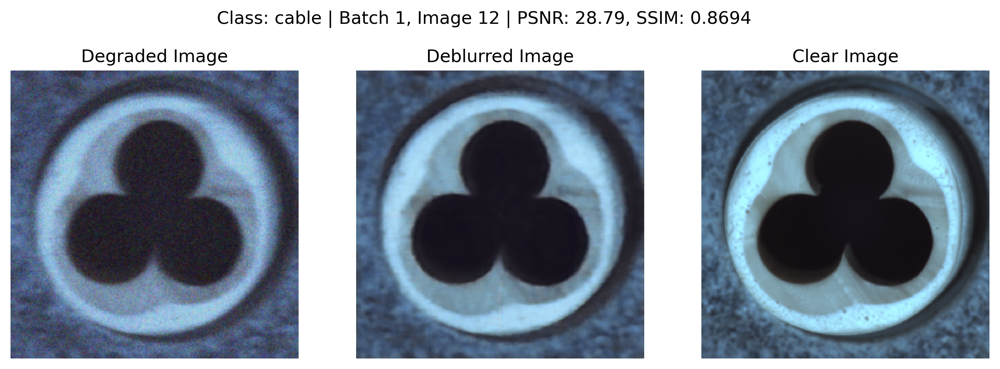
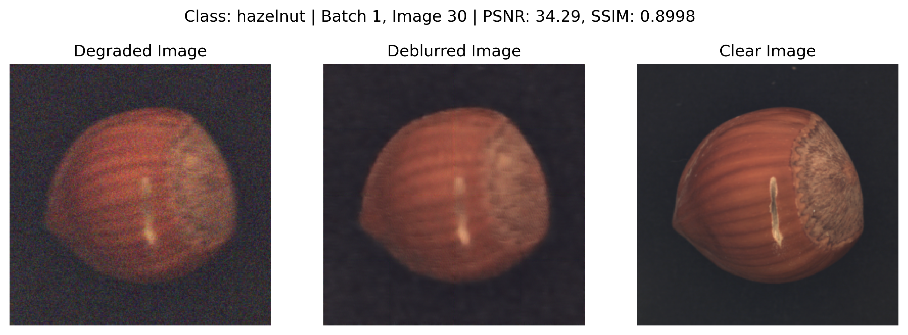
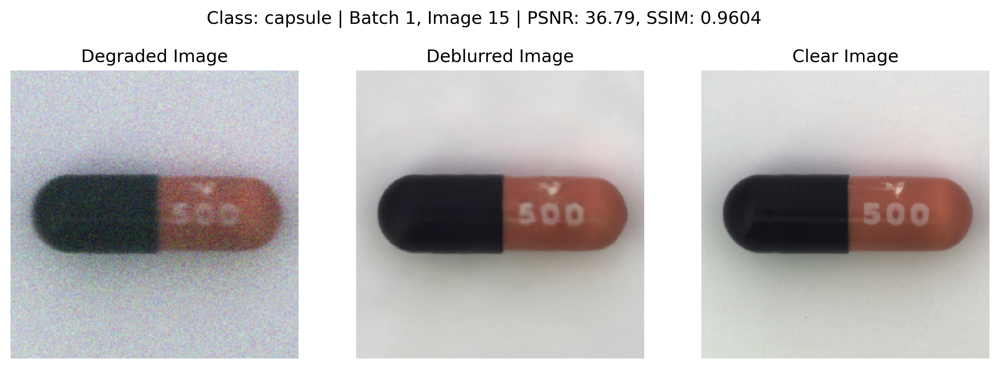

# Deblurring with Anomaly Detection

A project which aims to deblur the MVTec Anomaly Detection (AD) dataset where we deblur the images without removing the defects present in them.

## Installation

To set up the project, you need to install the required packages. You can do this by running the following command:

```bash
python -m venv venv
source venv/bin/activate
pip install -r requirements.txt
```

This will create a virtual environment and install the required packages.

## Usage

To run the project, you can use the following command:

```bash
jupyter notebook
```

Ensure the dataset is downloaded and present in the folder.
The code refers to paths as per kaggle, if run locally change the path accordingly.

## Sample Results

The following are the results of the project:

- Deep Multi-Patch Hierarchical Network (DMPHN) results:








- Encoder Decoder Results:





## PSNR and SSIM

- DMPHN Results:

    PSNR - Mean: 28.40, Std: 3.01
    SSIM - Mean: 0.8144, Std: 0.1002

- Encoder Decoder Results:

    PSNR - Mean: 31.62, Std: 3.51
    SSIM - Mean: 0.8757, Std: 0.0854

| **Class**      | **Method**         | **PSNR**               | **SSIM**               |
|----------------|--------------------|------------------------|------------------------|
| bottle         | DMPHN              | 27.00 ± 1.88          | 0.8623 ± 0.0066        |
|                | Encoder Decoder    | 32.00 ± 1.25          | 0.9197 ± 0.0031        |
| cable          | DMPHN              | 26.23 ± 1.31          | 0.8234 ± 0.0210        |
|                | Encoder Decoder    | 28.82 ± 1.12          | 0.8725 ± 0.0154        |
| capsule        | DMPHN              | 31.30 ± 2.92          | 0.9302 ± 0.0051        |
|                | Encoder Decoder    | 36.34 ± 1.34          | 0.9608 ± 0.0025        |
| carpet         | DMPHN              | 22.01 ± 0.37          | 0.6501 ± 0.0372        |
|                | Encoder Decoder    | 25.58 ± 0.52          | 0.8658 ± 0.0246        |
| grid           | DMPHN              | 25.71 ± 0.70          | 0.8318 ± 0.0424        |
|                | Encoder Decoder    | 29.81 ± 0.79          | 0.9367 ± 0.0110        |
| hazelnut       | DMPHN              | 31.28 ± 1.81          | 0.8927 ± 0.0141        |
|                | Encoder Decoder    | 34.12 ± 1.67          | 0.9327 ± 0.0059        |
| leather        | DMPHN              | 28.95 ± 0.80          | 0.6535 ± 0.0380        |
|                | Encoder Decoder    | 29.96 ± 1.09          | 0.6863 ± 0.0372        |
| metal_nut      | DMPHN              | 28.20 ± 0.36          | 0.7891 ± 0.0152        |
|                | Encoder Decoder    | 30.54 ± 0.24          | 0.8539 ± 0.0135        |
| pill           | DMPHN              | 31.57 ± 1.96          | 0.8949 ± 0.0430        |
|                | Encoder Decoder    | 36.03 ± 3.17          | 0.9383 ± 0.0479        |
| screw          | DMPHN              | 30.47 ± 2.54          | 0.9326 ± 0.0122        |
|                | Encoder Decoder    | 34.39 ± 1.32          | 0.9585 ± 0.0035        |
| tile           | DMPHN              | 25.31 ± 0.64          | 0.7488 ± 0.0125        |
|                | Encoder Decoder    | 26.23 ± 0.46          | 0.7971 ± 0.0090        |
| toothbrush     | DMPHN              | 29.88 ± 1.41          | 0.8804 ± 0.0357        |
|                | Encoder Decoder    | 31.64 ± 0.54          | 0.9167 ± 0.0064        |
| transistor     | DMPHN              | 28.61 ± 0.18          | 0.8583 ± 0.0107        |
|                | Encoder Decoder    | 32.19 ± 0.81          | 0.9288 ± 0.0070        |
| wood           | DMPHN              | 27.64 ± 1.37          | 0.6383 ± 0.0353        |
|                | Encoder Decoder    | 28.84 ± 1.26          | 0.7119 ± 0.0309        |
| zipper         | DMPHN              | 28.89 ± 1.07          | 0.7231 ± 0.0094        |
|                | Encoder Decoder    | 32.48 ± 0.42          | 0.7901 ± 0.0072        |
