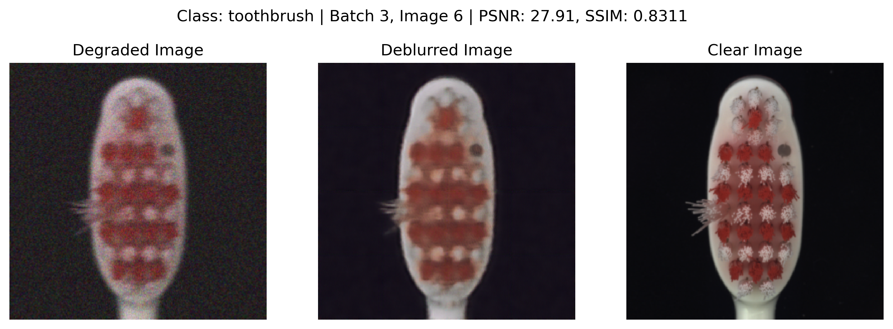
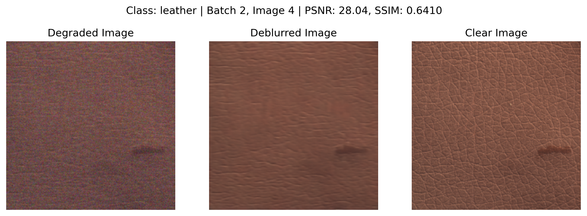
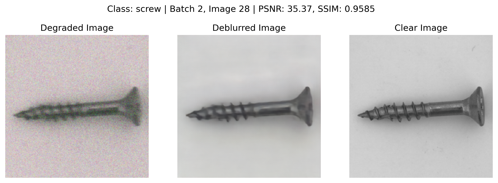
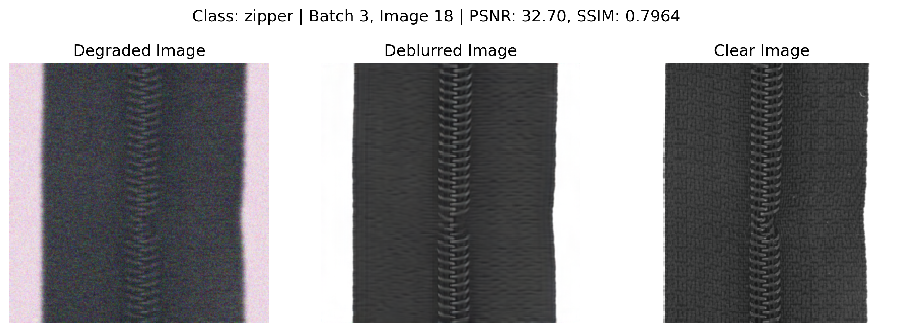

# Deblurring with Anomaly Detection

A project which aims to deblur the MVTec Anomaly Detection (AD) dataset where we deblur the images without removing the defects present in them.

## Installation

To set up the project, you need to install the required packages. You can do this by running the following command:

```bash
python -m venv venv
source venv/bin/activate
pip install -r requirements.txt
```

This will create a virtual environment and install the required packages.

## Usage

To run the project, you can use the following command:

```bash
jupyter notebook
```

Ensure the dataset is downloaded and present in the folder.
The code refers to paths as per kaggle, if run locally change the path accordingly.

## Sample Results

The following are the results of the project:

- Deep Multi-Patch Hierarchical Network (DMPHN) results:





- Encoder Decoder Results:











## PSNR and SSIM

- DMPHN Results:
    PSNR - Mean: 28.40, Std: 3.01
    SSIM - Mean: 0.8144, Std: 0.1002
- Encoder Decoder Results:
    PSNR - Mean: 31.62, Std: 3.51
    SSIM - Mean: 0.8757, Std: 0.0854
