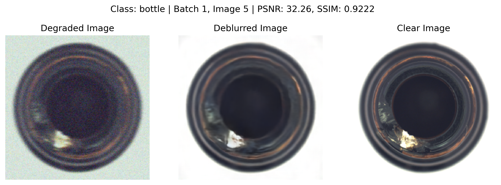
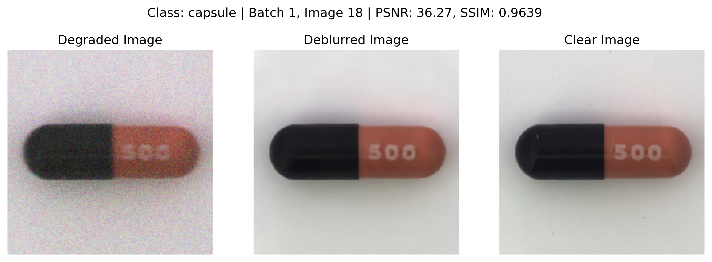

# Deblurring with Anomaly Detection

A project which aims to deblur the MVTec Anomaly Detection (AD) dataset where we deblur the images without removing the defects present in them.

## Installation

To set up the project, you need to install the required packages. You can do this by running the following command:

```bash
python -m venv venv
source venv/bin/activate
pip install -r requirements.txt
```

This will create a virtual environment and install the required packages.

## Usage

To run the project, you can use the following command:

```bash
jupyter notebook
```

Ensure the dataset is downloaded and present in the folder.
The code refers to paths as per kaggle, if run locally change the path accordingly.

## Sample Results

The following are the results of the project:

- Deep Multi-Patch Hierarchical Network (DMPHN) results:


- Encoder Decoder Results:








## PSNR and SSIM

- DMPHN Results:
    PSNR - Mean: 28.40, Std: 3.01
    SSIM - Mean: 0.8144, Std: 0.1002

Class-wise Summary Statistics:
Class: bottle
  PSNR - Mean: 27.00, Std: 1.88
  SSIM - Mean: 0.8623, Std: 0.0066

Class: cable
  PSNR - Mean: 26.23, Std: 1.31
  SSIM - Mean: 0.8234, Std: 0.0210

Class: capsule
  PSNR - Mean: 31.30, Std: 2.92
  SSIM - Mean: 0.9302, Std: 0.0051

Class: carpet
  PSNR - Mean: 22.01, Std: 0.37
  SSIM - Mean: 0.6501, Std: 0.0372

Class: grid
  PSNR - Mean: 25.71, Std: 0.70
  SSIM - Mean: 0.8318, Std: 0.0424

Class: hazelnut
  PSNR - Mean: 31.28, Std: 1.81
  SSIM - Mean: 0.8927, Std: 0.0141

Class: leather
  PSNR - Mean: 28.95, Std: 0.80
  SSIM - Mean: 0.6535, Std: 0.0380

Class: metal_nut
  PSNR - Mean: 28.20, Std: 0.36
  SSIM - Mean: 0.7891, Std: 0.0152

Class: pill
  PSNR - Mean: 31.57, Std: 1.96
  SSIM - Mean: 0.8949, Std: 0.0430

Class: screw
  PSNR - Mean: 30.47, Std: 2.54
  SSIM - Mean: 0.9326, Std: 0.0122

Class: tile
  PSNR - Mean: 25.31, Std: 0.64
  SSIM - Mean: 0.7488, Std: 0.0125

Class: toothbrush
  PSNR - Mean: 29.88, Std: 1.41
  SSIM - Mean: 0.8804, Std: 0.0357

Class: transistor
  PSNR - Mean: 28.61, Std: 0.18
  SSIM - Mean: 0.8583, Std: 0.0107

Class: wood
  PSNR - Mean: 27.64, Std: 1.37
  SSIM - Mean: 0.6383, Std: 0.0353

Class: zipper
  PSNR - Mean: 28.89, Std: 1.07
  SSIM - Mean: 0.7231, Std: 0.0094

- Encoder Decoder Results:
    PSNR - Mean: 31.62, Std: 3.51
    SSIM - Mean: 0.8757, Std: 0.0854

Class-wise Summary Statistics:
Class: bottle
  PSNR - Mean: 32.00, Std: 1.25
  SSIM - Mean: 0.9197, Std: 0.0031

Class: cable
  PSNR - Mean: 28.82, Std: 1.12
  SSIM - Mean: 0.8725, Std: 0.0154

Class: capsule
  PSNR - Mean: 36.34, Std: 1.34
  SSIM - Mean: 0.9608, Std: 0.0025

Class: carpet
  PSNR - Mean: 25.58, Std: 0.52
  SSIM - Mean: 0.8658, Std: 0.0246

Class: grid
  PSNR - Mean: 29.81, Std: 0.79
  SSIM - Mean: 0.9367, Std: 0.0110

Class: hazelnut
  PSNR - Mean: 34.12, Std: 1.67
  SSIM - Mean: 0.9327, Std: 0.0059

Class: leather
  PSNR - Mean: 29.96, Std: 1.09
  SSIM - Mean: 0.6863, Std: 0.0372

Class: metal_nut
  PSNR - Mean: 30.54, Std: 0.24
  SSIM - Mean: 0.8539, Std: 0.0135

Class: pill
  PSNR - Mean: 36.03, Std: 3.17
  SSIM - Mean: 0.9383, Std: 0.0479

Class: screw
  PSNR - Mean: 34.39, Std: 1.32
  SSIM - Mean: 0.9585, Std: 0.0035

Class: tile
  PSNR - Mean: 26.23, Std: 0.46
  SSIM - Mean: 0.7971, Std: 0.0090

Class: toothbrush
  PSNR - Mean: 31.64, Std: 0.54
  SSIM - Mean: 0.9167, Std: 0.0064

Class: transistor
  PSNR - Mean: 32.19, Std: 0.81
  SSIM - Mean: 0.9288, Std: 0.0070

Class: wood
  PSNR - Mean: 28.84, Std: 1.26
  SSIM - Mean: 0.7119, Std: 0.0309

Class: zipper
  PSNR - Mean: 32.48, Std: 0.42
  SSIM - Mean: 0.7901, Std: 0.0072

